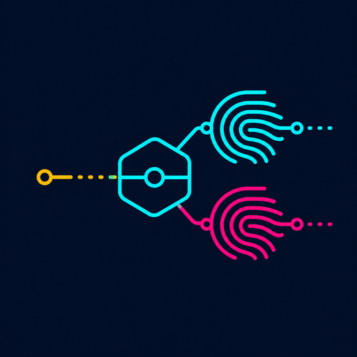

<p align="center">
  
</p>

<h1 align="center">mimic</h1>

<p align="center">
  <strong>Own the upstream identity.</strong><br>
  A fingerprint-aware HTTP/HTTPS compatibility proxy for authorized testing.
</p>

<p align="center">
  <a href="https://github.com/0typos/mimic/actions/workflows/ci.yml"></a>
  <a href="https://github.com/0typos/mimic/releases"></a>
  
  <a href="LICENSE"></a>
</p>

<p align="center">
  <a href="#first-handshake">Quickstart</a> ·
  <a href="#choose-the-last-hop">Traffic paths</a> ·
  <a href="#profiles-with-receipts">Profiles</a> ·
  <a href="#work-with-your-proxy">Burp &amp; Caido</a> ·
  <a href="#documentation">Docs</a>
</p>

> **The final TLS hop decides what the origin sees.**

`mimic` sits beside Burp Suite or Caido and owns the connection they cannot:
the last one to the origin. Select a captured or pinned client profile and
Mimic emits its TLS ClientHello, applies its HTTP presentation where it has
plaintext, and reports JA4 from the bytes it actually wrote.

Burp and Caido still inspect, edit, replay, and organize traffic. Mimic is the
small, single-binary transport identity layer behind them.

Mimic is pre-release software approaching its first public release. Its wire
and control protocols are versioned; compatibility is not promised until
`v1.0.0`.

## At a glance

| 🎭 Present it | 🔬 Prove it | 🧭 Bound it |
|---|---|---|
| Pinned and captured browser ClientHellos | JA4 calculated from the emitted bytes | Per-host routes and one-request overrides |
| Ordered HTTP/1.1 headers and HTTP/2 translation | Text or JSON conformance probes | Allowlisted TLS 1.0/1.1 compatibility retry |
| Direct intercept, Burp chain, and native Caido bridge | Live counters, logs, and profile provenance | Loopback TCP, Unix sockets, and listener CIDRs |

## See it work

<p align="center">
  
</p>

<p align="center">
  <sub>JA4 conformance, profiled HTTP, and intercepted HTTPS against local deterministic origins. <a href="docs/tutorial.md">Run the complete lab</a> or <a href="docs/tutorial/demos/01-quickstart.cast">play the terminal cast</a>.</sub>
</p>

## First handshake

The disposable lab builds Mimic, creates a lab-only interception CA, and starts
deterministic HTTP, modern TLS, and TLS-1.0-only origins:

```console
./lab/mimic-lab up
./lab/mimic-lab demo
```

The demo proves three things in order:

1. the Chrome 152 profile's expected and observed JA4 match;
2. a plaintext request receives the selected HTTP identity; and
3. an intercepted HTTPS request gets a new, profiled upstream TLS connection.

The lab needs [`uv`](https://docs.astral.sh/uv/), Docker Compose v2.20+, and
`curl`. It never contacts a public target or installs its CA into the host trust
store. Continue with the [five-minute quickstart](docs/quickstart.md) or the
[complete hands-on tutorial](docs/tutorial.md).

## Build

Release archives contain one static binary and checksums for Linux and macOS.
Until the first public release, build from source with Go 1.25.13 or newer:

```console
git clone https://github.com/0typos/mimic.git
cd mimic
make build VERSION=dev
cp config.example.toml config.toml
./mimic validate -config ./config.toml
./mimic daemon -config ./config.toml
```

`MIMIC_CONFIG` sets the default configuration path. Otherwise Mimic uses
`$XDG_CONFIG_HOME/mimic/config.toml`, or the platform-equivalent user config
directory.

## Choose the last hop

An ordinary CONNECT proxy cannot replace the ClientHello inside an opaque TLS
tunnel. Use a path where Mimic creates the final connection when transport
identity is part of the experiment.

| path | changes upstream TLS? | reach for it when… |
|---|---:|---|
| HTTP `intercept` | **yes** | a browser or Burp trusts the local Mimic CA |
| Caido bridge | **yes** | Caido supplies the edited plaintext request through `onUpstream` |
| HTTP `tunnel` | no | HTTPS should remain opaque to Mimic |
| SOCKS5 | no | the client must retain its own TCP/TLS identity, or needs UDP relay |

For interception, generate a local CA and trust only its public certificate in
the client that uses this listener:

```console
./mimic init-ca -cert ./certs/mimic-ca.pem -key ./certs/mimic-ca-key.pem
```

The private key is created with mode `0600`, is never served by Mimic, and must
never be shared or imported into a trust store.

## Profiles with receipts

Mimic ships a deliberately small catalog: five reproducible current-browser
captures and five pinned legacy uTLS presets. Inspect it with `mimic profiles`,
or ask a controlled sensor what one profile puts on the wire:

```console
$ mimic probe -config ./config.toml \
    -profile chrome-152-linux -target sensor.test.example:443
target:       sensor.test.example:443
profile:      chrome-152-linux
expected JA4: t13d1517h2_8daaf6152771_cb7bf5808d99
observed JA4: t13d1517h2_8daaf6152771_cb7bf5808d99
result:       PASS
```

Profiles can also be imported from a live ClientHello, raw/hex bytes, PCAP, or
PCAPNG. The TOML record carries lifecycle and provenance; captured bytes retain
extension order. See the [profile workflow](docs/profiles.md) and
[built-in capture provenance](docs/profile-captures.md).

A matching JA4 is useful evidence, not a claim of full browser emulation.
Mimic does not reproduce JavaScript-visible APIs, rendering, storage,
interaction, or every HTTP/2 frame choice.

## Route the narrowest intent

Profile selection is predictable:

```text
per-request or bridge override
        ↓
first matching host route
        ↓
live daemon default
        ↓ after restart
runtime.default_profile from TOML
```

Use a route for durable host policy, `mimic ctl use` for a session-wide
comparison, and `X-Mimic-Profile` for one Burp request. Legacy retry adds four
more gates: the feature is enabled, the host is allowlisted, its route permits
retry, and the first failure is an eligible protocol/cipher error. Certificate
verification failure never authorizes downgrade.

## Work with your proxy

| tool | connection path | CA boundary |
|---|---|---|
| regular browser | browser → Mimic intercept → origin | browser trusts Mimic CA |
| Caido | browser → Caido → Mimic native bridge → origin | browser trusts Caido CA; Mimic CA is not involved |
| Burp Suite | browser → Burp → Mimic intercept → origin | browser trusts Burp CA; Burp trusts Mimic CA |

The bundled Caido plugin exposes bridge enablement, profile override, daemon
status, counters, and log-level control. The [integration guide](docs/integrations.md)
walks through Caido domain opt-in and a narrow Burp upstream rule.

## Honest boundaries

- HTTP/3/QUIC is not implemented; UDP support is SOCKS5 datagram relay only.
- Intercepted WebSocket upgrades are not yet tunneled.
- HTTP/2 uses Go's frame implementation and does not claim browser-identical
  SETTINGS or frame ordering.
- JA4H is optional operator metadata; JA4S and JA4X describe server-side
  behavior and certificates, not this outbound client proxy.
- Listener, control endpoint, and CA changes require restart. Profiles, routes,
  legacy policy, and log level can reload live.

## Documentation

| Learn | Operate | Integrate | Trust & build |
|---|---|---|---|
| [Quickstart](docs/quickstart.md)<br>[Hands-on tutorial](docs/tutorial.md)<br>[CLI reference](docs/cli.md) | [Configuration](docs/configuration.md)<br>[Profiles](docs/profiles.md)<br>[Deployment](docs/deployment.md) | [Burp & Caido](docs/integrations.md)<br>[Protocols](docs/protocols.md)<br>[Architecture](docs/architecture.md) | [Threat model](docs/threat-model.md)<br>[Security policy](SECURITY.md)<br>[Testing](docs/testing.md) · [Releasing](docs/releasing.md) |

The terminal walkthroughs live in [`docs/tutorial/demos/`](docs/tutorial/demos/):
commit the playable `.cast` and rendered `.gif` together, and regenerate either
with `make demos` or `make demos-render`.

## Development

```console
make fmt-check
make test
make coverage
make lab-check
```

See [CONTRIBUTING.md](CONTRIBUTING.md) before submitting changes. Mimic is
licensed under the [MIT License](LICENSE); JA4 fingerprinting is covered by the
separate [FoxIO JA4 license](LICENSE-JA4), and dependency licenses are listed in
[THIRD_PARTY_NOTICES.md](THIRD_PARTY_NOTICES.md).

Use Mimic only with systems and traffic you are authorized to test.
