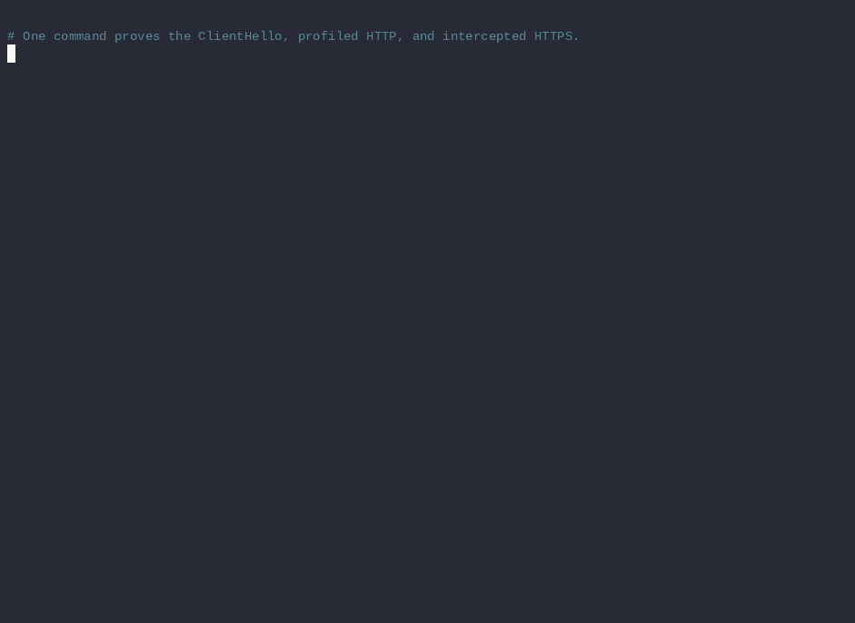
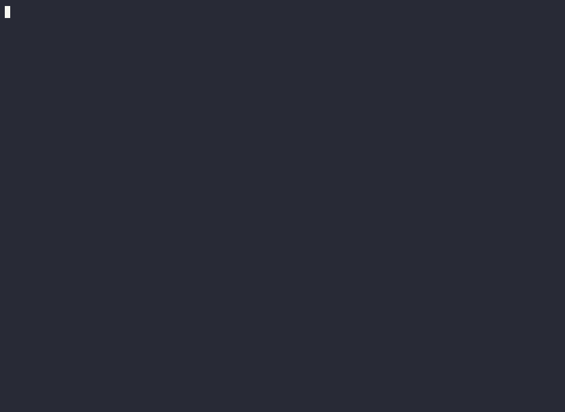

# Operating Mimic: a hands-on tutorial

This tutorial teaches how to use Mimic during normal research work. The lab is
still deterministic, but its output is used only to confirm decisions you make
as an operator: where Mimic belongs in a traffic path, which profile wins, when
a change is temporary, what needs a reload, and which CA each tool must trust.

Allow 35–50 minutes for the complete tutorial. If you already ran the
[five-minute quickstart](quickstart.md), start at
[The day-to-day operating loop](#3-the-day-to-day-operating-loop).

Use Mimic only with systems and traffic you are authorized to test.

The terminal demonstrations in this guide are recordings of the same local
lab commands. Each GIF links to a committed
[asciinema](https://asciinema.org) cast that you can play in a real terminal;
[`tutorial/demos/`](tutorial/demos/) contains the reproducible recording
driver.

By the end, you will be able to:

- choose correctly between interception, Caido, Burp, tunnel, and SOCKS paths;
- use a browser directly through Mimic;
- edit and replay traffic through Caido or Burp while Mimic owns upstream TLS;
- choose between a default profile, host route, and temporary override;
- install a captured profile and make it available without restarting;
- permit legacy TLS for one intended host without weakening every connection;
- validate, reload, observe, and troubleshoot a running daemon.

## 1. Start with the traffic path

Mimic is an upstream transport-identity layer. Burp and Caido remain the places
where you inspect, edit, replay, and organize requests:

```text
Browser ───────────────> Mimic intercept ───────────────> origin
Browser ─> Caido ──────> Mimic Caido bridge ───────────> origin
Browser ─> Burp ───────> Mimic intercept ───────────────> origin
Client  ───────────────> Mimic tunnel or SOCKS ─────────> origin
```

The final arrow matters. Mimic can replace the upstream TLS ClientHello only
when it creates that TLS connection.

| What you are doing | Mimic path | Changes upstream TLS? | Trust requirement |
|---|---|---:|---|
| Drive a regular browser directly | HTTP listener in `intercept` mode | yes | browser trusts Mimic CA |
| Edit/replay in Caido | Caido plugin and bridge listener | yes | no Mimic CA |
| Edit/replay in Burp | Burp upstream rule to intercept listener | yes | Burp trusts Mimic CA |
| Carry opaque HTTPS | HTTP listener in `tunnel` mode | no | none for Mimic |
| Carry arbitrary TCP/UDP | SOCKS5 | no | none for Mimic |

Use interception, the Caido bridge, or the Burp chain when transport identity is
part of the experiment. Use tunnel or SOCKS when you only want connectivity and
need to preserve the original client's TLS bytes.

The lab publishes these host-local endpoints:

| Endpoint | Purpose |
|---|---|
| `127.0.0.1:18080` | tunnel-mode HTTP proxy |
| `127.0.0.1:18081` | interception-mode HTTP proxy |
| `127.0.0.1:11080` | SOCKS5 TCP and UDP |
| `127.0.0.1:7777` | Caido data bridge |
| `127.0.0.1:9090` | lab-only forward to Mimic control |

The control forward exists only to let a host-local Caido plugin operate the
containerized tutorial daemon. Mimic itself still binds control to loopback and
refuses a remotely reachable control endpoint.

## 2. Prepare a disposable workstation session

You need [`uv`](https://docs.astral.sh/uv/getting-started/installation/), Docker
with Compose v2.20 or newer, and `curl`. The executable launcher follows the PEP
723 script format and carries a lock, so there is no virtual environment or
manual `pip install` step.

From a source checkout or release archive:

```sh
uv --version
docker compose version
docker info --format '{{.ServerVersion}}'
curl --version
./lab/mimic-lab up
```

If Docker reports a socket permission error, fix access to the engine before
continuing. Fish, Bash, and Zsh can all run the commands in this tutorial as
written; no shell-specific activation or exported lab variables are required.

The lab contains:

- `default-origin:8080`, a plaintext HTTP inspector with no route;
- `default-origin:8443`, an unrouted TLS alias useful for profile comparisons;
- `modern-origin:8443`, accepting TLS 1.2–1.3;
- `legacy-origin:9443`, accepting only TLS 1.0;
- one Mimic daemon with tunnel, intercept, SOCKS, Unix, and Caido listeners.

Confirm that the operating surfaces are ready:

```sh
docker compose -f lab/compose.yaml ps
./lab/mimic-lab status
./lab/mimic-lab profiles
```



<sub>▶ [`01-quickstart.cast`](tutorial/demos/01-quickstart.cast) — the three-step quickstart against deterministic local origins.</sub>

The lab's broad container CIDRs, self-signed origin trust, and intentionally old
TLS server are isolated teaching concessions. Do not copy those values into a
real deployment.

## 3. The day-to-day operating loop

A normal Mimic session has five steps:

1. validate configuration before starting or reloading;
2. start the daemon and confirm its selected profile;
3. send traffic through a path where Mimic can perform the intended work;
4. change profile or routing scope for the current experiment;
5. inspect status and logs when behavior differs from expectation.

In a native deployment, that looks like:

```sh
mimic validate -config ./config.toml
mimic daemon -config ./config.toml
mimic ctl -config ./config.toml status
```

The lab is already running, so use its wrapper for status and logs:

```sh
./lab/mimic-lab status
./lab/mimic-lab logs
```

Use `Ctrl-C` to leave the log view. It does not stop the containers.

When diagnosing one request, temporarily enable debug logging:

```sh
docker compose -f lab/compose.yaml exec -T mimic \
  mimic ctl -socket tcp://127.0.0.1:9090 log-level debug
```

Return to `info` after the experiment so normal traffic does not bury useful
events.

## 4. Decide which profile should win

Profile selection has an explicit precedence order:

```text
per-request or bridge override
        ↓ if empty
first matching host route
        ↓ if no match
live daemon default
        ↓ after restart
runtime.default_profile from TOML
```

Choose the narrowest mechanism that represents your intent.

| Intent | Mechanism | Duration |
|---|---|---|
| Compare most unrouted traffic as Firefox | `mimic ctl use` | until restart |
| Always use one profile for an application host | `[[routes]]` | persisted in TOML |
| Try one Burp request as another profile | `X-Mimic-Profile` header | one request |
| Try all currently selected Caido domains as another profile | plugin override | until changed |
| Change the startup baseline | `runtime.default_profile` | after daemon restart |

Change the live default without restarting:

```sh
docker compose -f lab/compose.yaml exec -T mimic \
  mimic ctl -socket tcp://127.0.0.1:9090 use lab-firefox

curl --noproxy "" --proxy http://127.0.0.1:18080 \
  http://default-origin:8080/inspect?workflow=live-default
```

`default-origin` has no route, so its response uses `lab-firefox`. Now request a
routed host:

```sh
curl --noproxy "" --proxy http://127.0.0.1:18081 \
  --cacert lab/.state/mimic-ca.pem \
  https://modern-origin:8443/inspect?workflow=routed
```

`modern-origin` still uses Chrome because its route is more specific than the
live default. This is a common reason a successful `mimic ctl use` appears not
to work.

Reset the session default when the comparison is over:

```sh
docker compose -f lab/compose.yaml exec -T mimic \
  mimic ctl -socket tcp://127.0.0.1:9090 use chrome-152-linux
```

Live selection is intentionally not written back to TOML. A restart returns to
`runtime.default_profile`.



<sub>▶ [`02-profile-precedence.cast`](tutorial/demos/02-profile-precedence.cast) — play the profile selection walkthrough with `asciinema play`.</sub>

## 5. Workflow A: use a regular browser directly

This is the shortest interactive path when you want to browse normally while
Mimic replaces the upstream TLS and HTTP presentation.

Use a dedicated browser profile so proxy and CA changes are easy to contain:

1. Import only `lab/.state/mimic-ca.pem` as a trusted certificate authority in
   that browser profile. Never import `mimic-ca-key.pem`.
2. Set the browser's HTTP and HTTPS proxy to `127.0.0.1`, port `18081`.
3. Do not add the lab origin names to the browser's proxy-bypass list.
4. Open `https://modern-origin:8443/inspect?workflow=browser`.

The page returns JSON from the origin. The `tls` and `cipher` fields describe
Mimic's upstream connection, while the user agent and ordered headers are the
HTTP identity Mimic applied.

For a quick command-line equivalent:

```sh
curl --noproxy "" --proxy http://127.0.0.1:18081 \
  --cacert lab/.state/mimic-ca.pem \
  https://modern-origin:8443/inspect?workflow=browser-equivalent
```

Use port `18080` instead when you deliberately want an opaque CONNECT tunnel.
That preserves the browser's own ClientHello but prevents Mimic from replacing
it. SOCKS has the same identity limitation.

There is also an important research boundary: Mimic changes the network and
HTTP presentation it owns. It does not change JavaScript-visible browser APIs,
rendering behavior, screen properties, storage, or user interaction. A profile
that conflicts with the real browser can therefore create a detectable
cross-layer mismatch. That mismatch can itself be useful in controlled tests,
but it is not full browser emulation.

At the end of a browser session, disable the proxy. Remove the lab CA from the
browser profile if you will not reuse the lab.

## 6. Workflow B: use the Caido plugin

This is the cleanest path for regular Replay, Intercept, Automate, and proxied
browser work because Caido gives Mimic the plaintext request through its
upstream hook. Mimic creates TLS only toward the destination.

### Install the plugin

Use the Caido asset from a release, or build it from source:

```sh
corepack enable
make caido
```

Install `integrations/caido/dist/plugin_package.zip` from Caido's plugin
installation page. The package contains both backend and frontend components.
Ensure both are enabled.

Open **Mimic** from Caido's sidebar. With the lab running, the initial settings
are already correct:

- bridge: `127.0.0.1:7777`;
- control: `127.0.0.1:9090`;
- bridge enabled;
- profile override empty.

The page should show **Connected**, the daemon's active profile, counters,
uptime, loaded profile count, and configuration path. **Check status** performs
an immediate control request.

### Opt in only intended domains

Caido requires an upstream plugin to be enabled per domain. In Caido's
**Upstream Plugins** settings, enable **Mimic Upstream** for these lab names:

- `default-origin`;
- `modern-origin`;
- `legacy-origin` only when testing the legacy workflow.

Start narrow in real projects as well. A domain not opted in continues through
Caido's normal upstream transport.

### Use the default, a route, or an override

Create a request in Replay:

```http
GET https://default-origin:8443/inspect?workflow=caido HTTP/1.1
User-Agent: Caido-Mimic-Tutorial/1.0
Accept: */*
```

`default-origin` has no Mimic route. Change **Daemon profile** on the Mimic page
and resend to test different live defaults. The active profile and counters
update without restarting either tool.

Next send the request to `modern-origin:8443`. Its configured route pins
Chrome, so changing the daemon default no longer wins. To run a temporary A/B
comparison, set **Bridge profile override** to `lab-firefox`, save, and resend.
The saved setting is attached to every request that the plugin currently
handles; clear it after the comparison to restore host routes.

When upstream negotiates HTTP/1.1, the Caido bridge retains Caido's raw request
bytes, so selecting a profile controls TLS without overwriting the message you
are editing. When upstream negotiates HTTP/2, Mimic must parse and translate
one request; during that translation it applies the profile's user agent and
configured headers. Keep this difference in mind when an experiment depends on
the exact HTTP message as well as the TLS fingerprint.

### Know which CA is involved

- A browser proxied through Caido trusts Caido's CA.
- Caido does not need to trust the Mimic CA for the native bridge.
- Mimic still verifies the real origin certificate according to its config.

The browser never connects to Mimic's interception listener in this path, so
trusting the Mimic CA would add risk without providing a benefit.

Use the page's **Enabled** switch as a global plugin-side bypass. When disabled,
selected domains return to Caido's normal upstream handling. Settings persist
in Caido's backend database and are available before the page is opened.

Official Caido references: [installing plugins](https://docs.caido.io/app/guides/plugins_installing)
and [upstream plugins](https://docs.caido.io/app/guides/upstream).

## 7. Workflow C: put Mimic behind Burp Suite

Burp remains responsible for its browser, Proxy, Repeater, Intruder, and
message editing. Mimic handles the connection Burp creates toward the origin.

There are two distinct CA relationships:

```text
browser ── trusts Burp CA ──> Burp ── trusts Mimic CA ──> Mimic ──> origin
```

Configure the lab path:

1. Keep Burp's normal proxy listener. Use Burp's browser or make an external
   browser trust Burp's CA.
2. In **Settings > Network > TLS > Custom CA certificates**, add the public
   `lab/.state/mimic-ca.pem`. Do not add its private key.
3. In **Settings > Network > Connections > Upstream proxy servers**, create a
   project rule for destination host `modern-origin`, proxy host `127.0.0.1`,
   and proxy port `18081`.
4. Send `https://modern-origin:8443/inspect?workflow=burp` from Repeater or the
   proxied browser.
5. Confirm Mimic's connection/request counters increase.

For one Repeater request, add this header:

```http
X-Mimic-Profile: lab-firefox
```

Mimic uses it as a one-request override and removes it before forwarding. This
is narrower than changing the daemon default and is usually the best Burp
workflow for A/B comparisons.

Do not point Burp at port `18080` when the goal is fingerprint replacement.
Burp's TLS remains opaque inside that CONNECT tunnel. Also avoid a wildcard
upstream rule until a narrow project rule works; accidental broad interception
creates confusing certificate and compatibility failures.

Official Burp references:
[upstream proxy rules](https://portswigger.net/burp/documentation/desktop/settings/network/connections),
[custom CA trust](https://portswigger.net/burp/documentation/desktop/settings/network/tls), and
[browser CA setup](https://portswigger.net/burp/documentation/desktop/external-browser-config/certificate).

## 8. Model a real project with routes

Routes are durable policy. Use them when a hostname should consistently receive
one transport profile, not merely for a short comparison.

A realistic configuration might say:

```toml
[runtime]
default_profile = "chrome-152-linux"

[[routes]]
host = "login.test.example"
profile = "firefox-154-linux"
legacy_retry = false
insecure_skip_verify = false

[[routes]]
host = "*.old-appliance.test"
profile = "chrome-133"
legacy_retry = true
insecure_skip_verify = false
```

Routes are case-insensitive hostname globs without ports. They are evaluated in
file order and the first match wins. Keep exact hosts above broad wildcards.

The safe edit cycle is:

```sh
mimic validate -config ./config.toml
mimic ctl -config ./config.toml reload
mimic ctl -config ./config.toml status
```

The running daemon swaps mutable configuration only after the new file
validates. Existing connections keep the snapshot they started with; new
connections see the new routes.

A reload retains the live selected profile when that profile still exists. If
you edit `runtime.default_profile` because you want a new startup baseline,
restart the daemon after validation rather than expecting reload to override an
intentional live selection.

## 9. Handle one legacy TLS host safely

Legacy compatibility and browser identity are separate choices. Mimic always
tries the selected profile first. It retries with the legacy policy only when:

1. legacy support and retry are enabled;
2. the hostname is allowlisted;
3. the matching route permits retry;
4. the failure is an eligible protocol or cipher error.

The lab has that policy only for `legacy-origin`. Exercise it through the same
interception path a browser or Burp would use:

```sh
curl --noproxy "" --proxy http://127.0.0.1:18081 \
  --cacert lab/.state/mimic-ca.pem \
  https://legacy-origin:9443/inspect?workflow=legacy

./lab/mimic-lab status
```

The response reports TLS 1.0 and `tls_fallbacks` increases. The debug log shows
the failed profile attempt followed by the bounded fallback.


<sub>▶ [`03-legacy-fallback.cast`](tutorial/demos/03-legacy-fallback.cast) — the bounded compatibility retry and its status evidence.</sub>

In a real config, keep the exception narrow:

```toml
[legacy]
enabled = true
min_version = "tls1.0"
retry = true
retry_on = ["protocol version", "handshake failure", "insufficient security"]
allow_hosts = ["management.old-appliance.test"]
insecure_skip_verify = false

[[routes]]
host = "management.old-appliance.test"
profile = "chrome-133"
legacy_retry = true
insecure_skip_verify = false
```

Do not add a broad wildcard merely to make an error disappear. Certificate
verification failure does not authorize downgrade, and disabling verification
is not a substitute for installing the correct private root. Mimic supports TLS
1.0–1.3; it does not support SSLv2 or SSLv3.

## 10. Capture and install a profile you actually need

The built-in catalog is intentionally small. Add a profile when a project needs
a client/version/platform that is not represented, and capture that real client
rather than relabeling an unrelated preset.

If you are working from source, build the local binary first:

```sh
make build
```

Temporarily disable the browser proxy so this one connection reaches the
capture listener directly. Then start a one-shot listener:

```sh
./mimic profile capture \
  -listen tcp://127.0.0.1:8443 \
  -name tutorial-browser \
  -output ./lab/.state/tutorial-browser.toml \
  -browser "Tutorial Browser" \
  -browser-version "1.0" \
  -platform "your operating system" \
  -lifecycle custom \
  -source "clean browser profile on controlled workstation"
```

Open `https://localhost:8443/` in a clean browser profile. The load failure is
expected: Mimic captures one ClientHello and intentionally does not complete
TLS.

The command creates a TOML snippet and a `.clienthello.hex` sidecar. Before
merging the snippet into `lab/mimic.toml`:

- review the recorded browser, version, platform, source, and calculated JA4;
- set an accurate user agent and headers if HTTP identity matters;
- change `client_hello_file` to
  `.state/tutorial-browser.clienthello.hex`, because the lab mounts
  `lab/.state/` at `/etc/mimic/.state/`.

Append the reviewed `[profiles.tutorial-browser]` table to `lab/mimic.toml`,
then validate and reload inside the container:

```sh
docker compose -f lab/compose.yaml exec -T mimic \
  mimic validate -config /etc/mimic/config.toml

docker compose -f lab/compose.yaml exec -T mimic \
  mimic ctl -socket tcp://127.0.0.1:9090 reload
```

Refresh the Caido Mimic page or run `./lab/mimic-lab profiles`; the new profile
should now be selectable. Finally, probe it against a controlled sensor:

```sh
docker compose -f lab/compose.yaml exec -T mimic \
  mimic probe -config /etc/mimic/config.toml \
  -profile tutorial-browser -target modern-origin:8443 -raw
```

A matching JA4 proves the emitted properties represented by JA4. It does not
prove byte-for-byte browser behavior, session resumption, HTTP/2 frames, HTTP/3,
JA4H, JavaScript state, or the rest of the JA4+ family. See
[Profiles](profiles.md) for PCAP import and detailed capture limitations.

## 11. Know when to use live control, reload, or restart

| Change | Action | Persists restart? |
|---|---|---:|
| selected default profile | `mimic ctl use` or Caido UI | no |
| log level | `mimic ctl log-level` | no unless TOML also changes |
| profiles and routes | validate, then `mimic ctl reload` | yes |
| runtime timeouts and legacy policy | validate, then reload | yes |
| listener or control addresses | validate, then restart | yes |
| MITM CA paths or logging format | validate, then restart | yes |
| Caido bridge endpoint/override | save on Mimic Caido page | stored by Caido |

Treat TOML as durable policy and live control as session state. This distinction
keeps experimental choices from silently becoming production defaults.

For a native daemon managed by systemd, a routine configuration change is:

```sh
mimic validate -config /etc/mimic/config.toml
mimic ctl -config /etc/mimic/config.toml reload
journalctl -u mimic --since "2 minutes ago"
```

If the control client reports that the change needs a restart, schedule one;
Mimic does not partially rebind listeners or replace a CA during reload.

## 12. Diagnose behavior from symptoms

Start with counters and the traffic path before staring at the response body:

```sh
./lab/mimic-lab status
./lab/mimic-lab logs
```

| Symptom | First thing to check |
|---|---|
| Connections do not increase | wrong port, proxy bypass, or Caido domain not opted in |
| Connections increase but requests do not | TLS/HTTP parse failure; enable debug logs briefly |
| Profile changed but target still uses another | a host route or explicit override has precedence |
| Browser fingerprint is unchanged | tunnel/SOCKS path; use interception or native Caido bridge |
| Caido retains the edited headers | expected when upstream negotiates HTTP/1.1 |
| Certificate error in direct-browser mode | browser must trust public Mimic CA |
| Certificate error in Burp chain | Burp—not the browser—must trust public Mimic CA |
| Caido page says unavailable | Mimic is stopped or control host/port is wrong |
| JA4 differs only with an IP target | IP literals omit hostname SNI and can change JA4 |
| Legacy endpoint still fails | allowlist, route permission, eligible error, and real CA trust |

Use the conformance probe when the question is specifically what Mimic put on
the wire:

```sh
docker compose -f lab/compose.yaml exec -T mimic \
  mimic probe -config /etc/mimic/config.toml \
  -profile chrome-152-linux -target modern-origin:8443 -raw
```

`expected JA4` and `observed JA4` should match. `JA4_r` shows normalized input;
`JA4_ro` retains original extension order for diagnosis. This is a targeted
check, not the main daily interface.

After configuration changes, the automated regression tour remains useful:

```sh
./lab/mimic-lab check
```

It exercises every lab transport and policy path, but it is a verification
command rather than a substitute for the operating workflows above.

## 13. Finish the lab and carry the model forward

Stop the disposable environment:

```sh
./lab/mimic-lab down
```

Compose preserves `lab/.state/` for fast restarts. The documented curl commands
trusted the CA only for their individual processes. A browser, Burp, or Caido
trust change must be removed from that tool when you are finished. Delete
`lab/.state/` only after the lab is down if you want to discard its CA, private
key, and captured tutorial profiles.

For a real project, keep this checklist:

1. decide whether Mimic must originate upstream TLS;
2. use a dedicated browser/tool trust boundary;
3. start with loopback listeners and narrow destination scope;
4. leave routes active and overrides empty unless running an explicit test;
5. validate before reload and verify status after it;
6. enable legacy retry only for named hosts;
7. use `probe` and debug logs when transport evidence is actually needed.

Continue with the [configuration reference](configuration.md),
[deployment guide](deployment.md), [threat model](threat-model.md), and
[control/bridge protocols](protocols.md) when moving from the lab to a managed
daemon.
